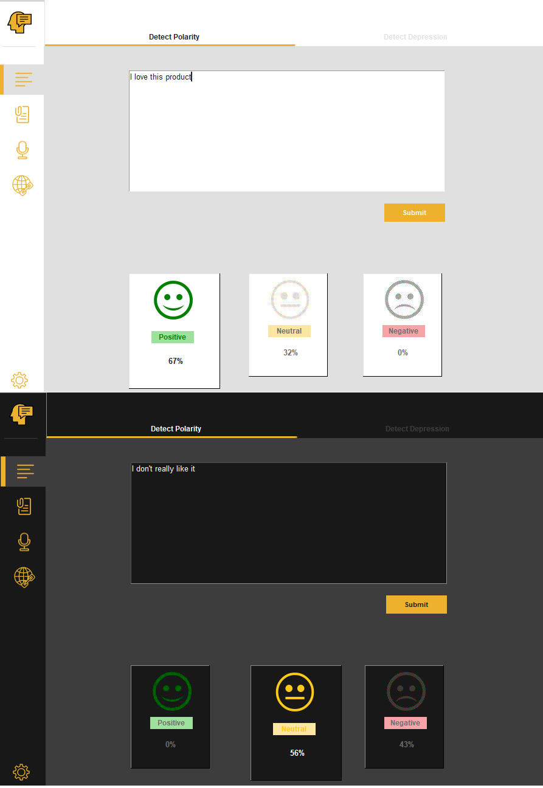

# 😊😐☹ Sentiment247

Sentiment247 is an application that dectects emotional tone in text data by dictating polarity and determining depression using NLP techniques.

 
Please star⭐ the repo if you like or wish to contribute to this project.
 

 

## ✨ Features
You can perform sentiment analysis on text from various sources such as
- [x] Direct text from keyboard.
- [x] Documents.
- [x] Images.
- [x] Voice records.
- [x] Social Media Posts(ie. Twitter, Facebook, Instagram).
In this version 1.0 only twitter is supported

## 💻 Requirements
* Windows Operating System
* Any IDE or code editor  (ie. Pycharm, VSCode etc) with python installed
* Some python skills

## 🔌 Dependencies
| Name | Usage | Version |
|------|-------|---------|
|[**Pillow**](https://pypi.org/project/Pillow/)| Rendering Images| 8.0.1|
|[**Twython**](https://pypi.org/project/twython/)| Twitter API| 3.8.2|
|[**Emoji**](https://pypi.org/project/emoji/)| Identify Emoji's| 0.6.0|
|[**Validators**](https://pypi.org/project/validators/)| Validate url's| 0.18.2|
|[**Google Cloud**](https://pypi.org/project/google-cloud/)| Image to text| 0.34.0|
|[**NLTK**](https://pypi.org/project/nltk/)| Natural Language Tool Kit| 3.5|
|[**Pandas**](https://pypi.org/project/pandas/)| Data Processing| 1.1.4|
|[**Numpy**](https://pypi.org/project/numpy/)| Numerical Computations| 1.19.4|
|[**Pickle**](https://pypi.org/project/pickle4/)| Save and load ML model| 0.0.1|

## 🤓 Author(s)
**David Oden.** 

## 🔖 LICENCE
    Copyright 2020 David Oden

    Licensed under the Apache License, Version 2.0 (the "License");
    you may not use this file except in compliance with the License.
    You may obtain a copy of the License at

       http://www.apache.org/licenses/LICENSE-2.0

    Unless required by applicable law or agreed to in writing, software
    distributed under the License is distributed on an "AS IS" BASIS,
    WITHOUT WARRANTIES OR CONDITIONS OF ANY KIND, either express or implied.
    See the License for the specific language governing permissions and
    limitations under the License.

